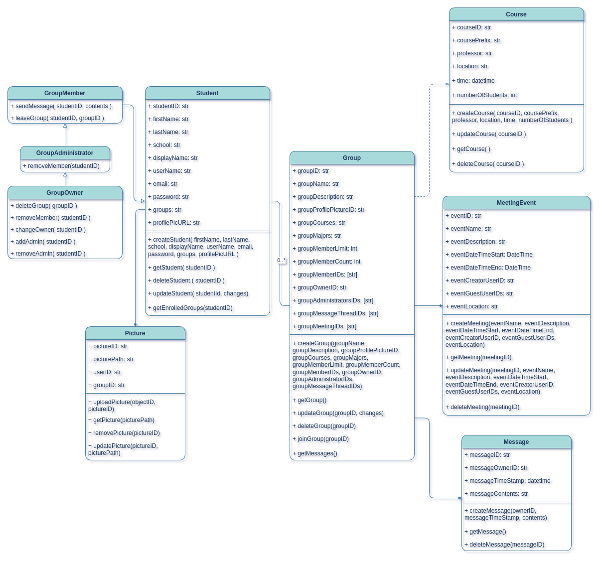

# System Description

Our project focuses on the problem of difficulty in connecting with peers for study collaboration affects college students across various disciplines, particularly those in larger universities who may feel isolated or unsure about finding study groups. The impact of this problem is diminished academic performance, increased stress, and lost opportunities for social interaction and skill development, which can lead to lower retention rates and a lack of community among students. The product is for college students who struggle to find and connect with study groups for collaborative learning. The name of the product is StudySphere which is a web platform that simplifies the process of discovering, joining and scheduling study groups to enhance academic success and build community. Unlike traditional social media platforms or general messaging apps. Our product focuses specifically on connecting students based on their courses and study needs, fostering a supportive academic environment. StudySphere empowers students to collaborate by simplifying the process of finding and connecting with study groups, enhancing academic success aligning with our slogan "Study Smarter Together”.

StudySphere allows students to create, manage, and delete their own **student accounts** as needed. The creation of the **student account** deals with attributes such as *email, password, username, Firstname, Lastname, and college* all of which are required prior to account creation. *username* cannot be changed post-registration. Users also have the ability to delete their **student accounts** if they feel the need to do so. The management part of the system relates to the user settings, a subset of account management covered in the following paragraph.

A key requirement in Study Sphere is managing **user settings**, this requirement allows students to manage their **student account** information. Through **user settings** a student can manage information such as *First name, Last name, email, university, profile picture, display name, and password* This feature is critical for accommodating different user needs and preferences, allowing students to customize their interaction with **groups, message threads,** and other platform features. Personalizing these settings ensures a flexible user experience. 

StudySphere offers **group chats** that are moderately customizable in order to enhance the overall user experience and allow for efficient communication between students ( the main purpose of the product ). Each **group chat** allows the **owner** or **administrators** to modify **attributes** such as *group profile picture, group description, group title, members, member count limit, calendar updates, the deletion of the group, the creation of the group, and background color*. These **group chats** provide real time communication between **student accounts** and **groups**, enabling **users** to communicate effectively, plan meetings or study sessions, and most importantly making friends within their community.

Another essential feature requirement involves managing **group settings**. This functionality allows students to customize key aspects of any **group** they create or join, including setting a *group name*, providing a *group description*, and determining the *member limit*. Additionally, users can view the *Group ID* and the *Member IDs* of group participants, ensuring each **group** is tailored to meet specific study needs. This capability fosters a safe, organized, and collaborative space, where members can engage effectively in their academic pursuits.

For the non-functional requirements, performance is critical to ensure smooth interactions with the platform. The user experience relies on *low latency* and consistent guaranteed performance,as it directly impacts usability and user satisfaction. The system should maintain a response time of less than 5 seconds for chat and other high-priority interactions. Performance is especially emphasized in user stories like "Jack's" need to communicate with group members and schedule times efficiently.

Platform security is at the forefront of our design in order to keep user data secure. The system must disallow unauthenticated users from interacting with the system. Additionally, authentication must be handled in a secure manner with the *password* being properly encoded/hashed/encrypted both during transmission and when it is being stored.

Scalability is important to the future of our project. In order to serve a potentially growing user base, the system must be structured to minimize the maintenance overhead that comes with mismatched scaling expectations. Failure to do so may result in unanticipated system errors and/or downtime, which would decrease the reliability of the system.

Compatibility across devices is essential to ensure that the platform is accessible by students using different systems, whether on mobile,or desktops. Multi-device functionality allows a seamless user experience regardless of device and browser, allowing for better access. Compatibility and better accessibility is directly in line with our goal of making study groups more widespread and easier to find.

# Model

