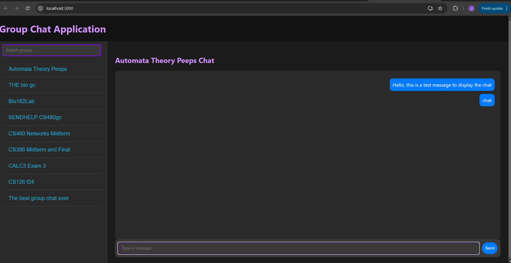
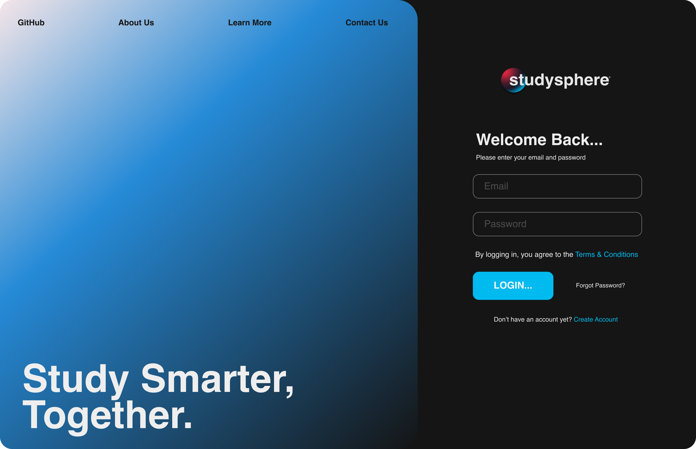

# D.4 Implementation 1

## 1. Introduction

StudySphere is an application designed to provide students with a simple, straightforward approach to creating, joining, and managing study groups. Our site makes it easier than ever to find other like-minded individuals looking to ‘study smarter together’! Groups are equipped with real-time messaging and optimized scheduling technology to service users who want to connect both virtually and in person! The current project can be found at the following link: [StudySphere GitHub Repository](https://github.com/jadynlaila/Study_Group_Platform)


## 2. Implemented requirements


### Jadyn Calhoun 

**Requirement:** As a student, I want to be able to create an account with all of my information.

**Issue:** [User Story - Account Creation ](https://github.com/jadynlaila/Study_Group_Platform/issues/100)

**Pull request:** [Pull Request](https://github.com/jadynlaila/Study_Group_Platform/pull/84)

**Implemented by:** Jadyn Calhoun

**Approved by:** Daira Santacruz

**Print screen:** 


**Requirement:** As a student, I want to be able to freely update my account information and settings.

**Issue:** [User Story - Account Setting Management](https://github.com/jadynlaila/Study_Group_Platform/issues/101)

**Pull request:** [Pull Request](https://github.com/jadynlaila/Study_Group_Platform/pull/84)

**Implemented by:** Jadyn Calhoun

**Approved by:** Daira Santacruz

**Print screen:** 


**Requirement:** As a recently graduated student, I would like to delete my account as I no longer need study groups.

**Issue:** [User Story - Account Deletion](https://github.com/jadynlaila/Study_Group_Platform/issues/102)

**Pull request:** [Pull Request](https://github.com/jadynlaila/Study_Group_Platform/pull/84)

**Implemented by:** Jadyn Calhoun

**Approved by:** Daira Santacruz

**Print screen:** 


**Requirement:** As a student, I want to leave some of the groups I joined for old classes.

**Issue:** [User Story - Group Removal](https://github.com/jadynlaila/Study_Group_Platform/issues/103)

**Pull request:** [Pull Request](https://github.com/jadynlaila/Study_Group_Platform/pull/84)

**Implemented by:** Jadyn Calhoun

**Approved by:** Daira Santacruz

**Print screen:** 


**Requirement:** As a student, I want to join groups related to my classes.

**Issue:** [User Story - Joining Groups](https://github.com/jadynlaila/Study_Group_Platform/issues/23)

**Pull request:** [Pull Request](https://github.com/jadynlaila/Study_Group_Platform/pull/84)

**Implemented by:** Jadyn Calhoun

**Approved by:** Daira Santacruz

**Print screen:** 

### Daira Santacruz

**Requirement:** As a student, I want to be able to communicate well with my groups so that we can keep our conversations organized.

**Issue:** [User Story - Organized Communication ](https://github.com/jadynlaila/Study_Group_Platform/issues/31)

**Pull request:** [Pull Request](https://github.com/jadynlaila/Study_Group_Platform/pull/108)

**Implemented by:** Daira Santacruz

**Approved by:** 

**Print screen:** 


### Jack Lealos

**Requirement:** As a student, I want to be able to connect with other students so that we can communicate times to meet and study.

**Issue:** 
 [User story- Student Communication](https://github.com/jadynlaila/Study_Group_Platform/issues/40)
[Main UI - Text Region #92](https://github.com/jadynlaila/Study_Group_Platform/issues/92)

**Pull request:** [Jack frontend contributions #111](https://github.com/jadynlaila/Study_Group_Platform/pull/111)

**Implemented by:** Jack Lealos

**Approved by:**

**Print screen:** 


### Alexander Anthis


### Rudra Amin


### Valentino Valero

**Requirement:** As a student, I want to be able to find students in my class section so that I can meet people who are on the same page as me.

**Issue:** 
 [User Story - Easy to navigate #43](https://github.com/jadynlaila/Study_Group_Platform/issues/43)

**Pull request:** [NavBar Pull Request](https://github.com/jadynlaila/Study_Group_Platform/pull/97)

**Implemented by:** Valentino Valero

**Approved by:**

**Print screen:** 


## 3. Tests
You should implement automated tests that aim to verify the correct behavior of your code. Provide the following information:

Test framework you used to develop your tests (e.g., JUnit, unittest, pytest, etc.)

Link to your GitHub folder where your automated unit tests are located

An example of a test case. Include in your answer a GitHub link to the class being tested and to the test

A print screen showing the result of the execution of the automated tests

Grading criteria (4 points): You should have an adequate number of automated tests. They should be well-written to exercise the main components of your system, covering the relevant inputs.
### Jadyn Calhoun
**Test Framework:** Jest and Supertest

**Automated Tests Location:** [Student Controller Tests](https://github.com/jadynlaila/Study_Group_Platform/pull/84/commits/e00beb0edbac8463df7b24761da9a762c42c6398#diff-ca0be02e24395e61b80efaf64d749fcd2dc48daa079b6fcb10114a5ba2c61a35)

**Test Case Example:** The following is a test that determines if a students information is being updated accurately  The class being tested is located at [Student Controller Functions](https://github.com/jadynlaila/Study_Group_Platform/pull/84/commits/e00beb0edbac8463df7b24761da9a762c42c6398#diff-daf6cac8ddaf8706d604efcb5a394bb39b4635f70de2479aa57976690932c6a6) and the tests are located at [Student Controller Tests](https://github.com/jadynlaila/Study_Group_Platform/pull/84/commits/e00beb0edbac8463df7b24761da9a762c42c6398#diff-ca0be02e24395e61b80efaf64d749fcd2dc48daa079b6fcb10114a5ba2c61a35)

**Execution Result:** 

### Alexander Anthis
**Test Framework**: Jest and Supertest

**Automated Tests Location**: [studentController.test.js](https://github.com/jadynlaila/Study_Group_Platform/blob/65-dev_backend_groupController/backend/controllers/studentController.test.js)

**Test Case Example**: 
```javascript
test('should update a group', async () => {
    const name = "JEST Test Group"
    const description = "This is a test"
    const courses = "CS386"
    const updatedCourses = "CS300"
    const majors = "Computer Science"
    const ownerID = studentID
    const profilePictureID = null

    // Create the group first
    // Send the put request
    const createResponse = await request(`${serverAddress}/api/group`).put('/').send({
        name, description, courses, majors, memberLimit: 6, ownerID, profilePictureID
    });
    
    // Deconstruct the body of the response
    const { groupID, group } = createResponse.body;
    
    // TEST: Make sure the group was created
    expect(createResponse.status).toBe(201)

    // Send an updated group
    // Send the post request
    const updateResponse = await request(`${serverAddress}/api/group`).post('/').send({
        groupID,
        courses: updatedCourses,
    })

    // TEST: make sure we get a good status code
    expect(updateResponse.statusCode).toBe(200)

    // Instead of using the response object, obtain the updated object from Mongo
    let searchedGroup = await Group.findById(groupID)

    console.log(`Old group: ${JSON.stringify(group)}`)
    console.log(`Updated group: ${searchedGroup}`)

    // TEST: make sure the group was updated
    expect(searchedGroup.courses).toBe("CS300")

    await Group.findByIdAndDelete(groupID)
});
```

**Execution Result**:


## 4. Adopted technologies

**JavaScript** is a versatile, high-level programming language primarily used for adding interactivity to web pages. It enables dynamic content, user engagement, and complex functionalities on both the client and server sides. There is a large community of people who work with this technology, so it also has extensive resources, support, and libraries available.

**CSS** is a stylesheet language that allows developers to apply styles, such as colors, fonts, and spacing to pages, creating visually appealing and responsive designs.

**Node.js** is a JavaScript runtime that allows for server-side development, providing a unified language across the stack. Its event-driven architecture is perfect for building scalable, real-time applications, making it a strong choice for connecting students on the StudySphere platform.

**Express** is a fast and minimalist web framework for Node.js. It provides simplified routing and middleware management, which is ideal for our organization.

**Express async Handler** is Express’s default error handler and assists in overall error management as well as the code’s readability.

**JSON Web Token (JWT)** is essential for user authentication and session management. It creates tokens when a user logs in that will expire and sign them out after a defined amount of time passes.

**MongoDB** is a NoSQL database that allows flexible, document-based data storage, making it easy to scale and adapt as the application grows.

**Mongoose** is a library for MongoDB that makes working with the database data more structured and organized. Specifically, we use it to create models of the data and to verify that given IDs are valid MongoDB IDs.

**React** is a JS library for building user interfaces that enables the creation of interactive, component-based UIs, perfect for the dynamic features of the platform.

**Dotenv** is a module for managing environment variables that keeps sensitive configuration details secure and separate from the codebase.

**Nodemon** is a utility that will automatically restart the server when changes are detected, helping assist in the development workflow.

**Jest** is a JS testing framework that supports simple, effective, and (most importantly) readable testing.

**Supertest** is a library that helps with the testing of REST APIs, which the backend depends on.


## 5. Learning / Training

The team used several strategies to learn React, MongoDB, and Jest, which were new to many of us. We relied on YouTube tutorials and reference videos to get a solid understanding and build a working React project with MongoDB integration. Stack Overflow was also a key resource, providing quick answers and solutions to specific coding issues we encountered.

For automated testing, we used Jest, which at first seemed challenging. However, online tools and documentation made it easier to apply. With these resources, we successfully validated component outputs for Deliverable 4 and ensured key features were tested. Overall, the combination of tutorials, Stack Overflow, and open-source resources gave us the knowledge needed to meet our project goals.

## 6. Deployment

*Provide a link for the system in production and describe how you are deploying your system.*

*Some alternatives for deploying your system in the cloud:*

- *AWS. AWS Educate offers free credits for students. See the tutorial at https://docker-curriculum.com/Links to an external site. on how to create a container and deploy it on AWS.*
- *Digital Ocean or Azure. As part of the GitHub Education benefits, as a student, you can get $100 at Digital Ocean and $100 at Microsoft Azure cloud computing platforms (see more details at https://education.github.com/studentsLinks to an external site.).*
- *Oracle Cloud. Oracle offers a free tier in its cloud environment that should be more than enough for your needs.*
- *Firebase. Firebase can be a good choice if you are building a mobile phone app.*

*Grading criteria (3 points): This section will be graded based on the adequate use of the technology and its adequate description.*

Our software will be deployed as a web server on a remote server hosted by Hostwinds which we have previously set up. We additionally obtained the domain `study-sphere.me` so anyone can easily navigate to the website and set that up appropriately.

To access the servers you can follow the following links:

Front End React Server: http://study-sphere.me:3001

Back End API: http://study-sphere.me:6000


## 7. Licensing

We chose to apply the Apache license to our software. There are several reasons for this:

- Anyone can use and redistribute our software/code.
- Our trademark cannot be used.
- There is no warranty provided, so the software is provided as is. However, derivatives can choose to offer their own warranties.

## 8. README File
You should also prepare your repository to receive new developers. You should prepare a README.md file. See an example at https://gist.github.com/PurpleBooth/109311bb0361f32d87a2Links to an external site.. In the README file, the current version of the software should be stated. You should follow the Semantic VersioningLinks to an external site. schema. Tag the GitHub repository accordingly (see Git Basics TaggingLinks to an external site.). 

Your repository should contain a CONTRIBUTING.md file, a LICENSE file, and a CODE_OF_CONDUCT.md file. Search online for some examples of these files. In this section of the deliverable, put links to these files on GitHub.

Grading criteria (3 points): This section will be based on the presence and quality of the information presented in the files.

## 9. Look & feel
When we first started this project, we quickly realized that if we wanted to design a groupchat-focused-webapp that appeals to college students we'll have to compete directly with other existing and commonly used methods: Snapchat, Groupme, Discord. With those products in mind, we decided our approach was simplicity and focused functionality whilst trimming out the fat that the other products mentioned offer ( features not necessary for academic use such as Snapchats Live Location services, GroupMe's Built in Meme-Maker, Discords Game Linking Functionality ) and instead implement curated features meant to exclusively suit a students success in college not only academically but socially. As you can see in our screenshots our UI is very simple and doesn't overwhelm the user with too many options at once, this was intentional and reflective of what we heard in many of our interviews. While not fully implemented yet, we use a mix of web materials like frosted glass effects and an almost bento-box styled layout. The purpose of this is to fulfill our nonfunctional requirement of scalability; if our UI is already built in a modular manner, it'll be far easier to implement new features later down the line. Taking a look at the wire frame ( 3rd image ) youll see the ways of which we split every component up.

NOTE: The displayed images are from our Figma project file and are not representative of our current product. These images shall however be taken as a reference for what we hope our product will look like by the end of this course.



## 10. Lessons learned

Through our first release of StudySphere, we learned that having a structured plan is key to completing a deliverable efficiently and in an organized manner. Although we struggled with coordinating in-person meetings, we found that online meetings worked well for everyone’s convenience, allowing us to stay connected and aligned. For our second release, we're excited to implement more regular check-ins and establish a clearer workflow for code reviews. This way, we can ensure that everyone is on the same page and enhance our collaboration. We're looking forward to streamlining our development efforts and achieving an even more successful outcome together. 

## 11. Demo
StudySphere Demo: https://youtu.be/2Xfjad_uX2Q

## ASSIGNMENTS: 
Intro (1pt) - Jadyn 

Implemented Requirements (10pts) - Everyone

Tests (4pts) - Everyone

Adopted Technologies (1pt) - Jadyn and Daira

Learning and training (1pt) - Jack 

Deployment (3pts) - Daira

Lincensing (1pt) - Alex

README (3pts) - Daira and Rudra

Look and feel (3pts) - Valentino 

Lesson Learned (2pts) - Everyone

Demo (6pts) - Alex
