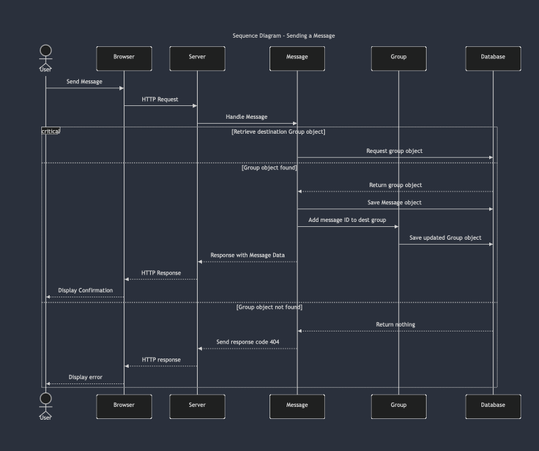

# Deliverable 5 - Group 7

## Instructions
In this deliverable, you should describe the architectural design of your system. Structure your deliverable using the following sections. See the [Team Project Instructions](https://canvas.nau.edu/courses/29116/pages/team-project-%7C-overview) for details about formatting. Check the lecture materials and perform additional research to produce a high-quality deliverable. As usual, if you have any questions, let me know.

## 1. Description
Provide 1-2 paragraphs to describe your system to help understand the context of your design decisions. You can reuse and update text from the previous deliverables.

Grading criteria (2 points): Completeness; Consistency with the rest of the document; Adequate language.

## 2. Architecture
Present a diagram of the high-level architecture of your system. Use a UML package diagram to describe the main modules and their interrelation. Please check these [examples](https://www.uml-diagrams.org/package-diagrams-overview.html). Make clear the layers of your architecture (if they exist) as described in [Multi-Layered Application: UML Model Diagram Example](https://www.uml-diagrams.org/multi-layered-application-uml-model-diagram-example.html).

Provide a brief rationale of your architecture explaining why you designed it that way. 

Grading criteria (5 points): Adequate use of UML; Adequate design of an architecture for the system; Adequate description of the rationale.

## 3. Class diagram
Present a refined class diagram of your system, including implementation details such as visibilities, attributes to represent associations, attribute types, return types, parameters, etc. The class diagram should match the code you have produced so far but not be limited to it (e.g., it can contain classes not implemented yet). 

The difference between this class diagram and the one you presented in D.3 is that the latter focuses on the domain's conceptual model, while the former reflects the implementation. Therefore, the implementation details are relevant in this case. 

Grading criteria (6 points): Adequate use of UML; Adequate choice of classes and relationships; Completeness of the diagram; Adequate presentation of implementation details. 

## 4. Sequence diagram

## 5. Design Patterns

### Behavioral
A design pattern used in the fronend development was the MVC or Model-View-Controller design pattern. The pattern seperates the components for data, logic and presentation. The MVC pattern can be seen very clearly in how the front end behaves due to the way the groupchat module and text region are used and how the components act as the individual components of the pattern. 

Text Region: https://github.com/jadynlaila/Study_Group_Platform/blob/dev_frontend/frontend/src/components/TextRegion.jsx 

groupChatModule: https://github.com/jadynlaila/Study_Group_Platform/blob/dev_frontend/frontend/src/components/GroupChatModule.jsx 

## 6. Design Principles

### Single Responsibility Principle
*A class should have one and only one reason to change, meaning that a class should have only one job.*

In our product, the `Student`, `Group`, and `Message` classes meet the criteria for the Single Responsibility Principle as these classes are each responsible for their own tasks and not each others', but for circumstances where an object from one class has to modify data within another class, that target class's interface is called. For example, if a student object is trying to join a group, it will use interfaces from the Group class in order to perform those actions.

### Open-Closed Principle
*Objects or entities should be open for extension but closed for modification.*

In our product, our classes implement the Open-Closed Principle as each class is open to having subclasses and other extensions without requiring the modification of the parent classes. For example, if we wanted to make a subclass of `Group` such as `ProjectGroup` or `StudyGroup`, the parent class would not have to be modified.

### Liskov Substitution Principle
*Subtypes should be replaceable by their base types*

Within our product, subtypes (which currently do not exist) are able to be replaced by their base types, fulfilling the Liskov Substitution Principle. For example, if we were to make a subclass `ProjectGroup` from `Group`, then you can still treat both classes the same.

### Interface Segregation Principle
*A client should never be forced to implement an interface that it doesn’t use, or clients shouldn’t be forced to depend on methods they do not use.*

Our product does not currently follow the Interface Segregation Principle as our classes `Student`, `Group`, and `Message` are currently only have catch-all interfaces that handle everything about that class. While we could modify our class structure to accomodate for that, it isn't currently implemented, nor is it particularly on our roadmap.

### Dependency Inversion Principle
*Entities must depend on abstractions, not on concretions. It states that the high-level module must not depend on the low-level module, but they should depend on abstractions.*

Each class contains two implementation types:
- HTTP request
- Mongoose library calls

Both of these implementation methods contain a one-way abstraction where the caller doesn't need to know how how either implementation works but can still work with data in a simple way.

For example, the `Student` class contains abstraction methods for obtaining/saving data via an HTTP request, and those abstraction methods contain further abstractions for saving or retreiving data from the database.
