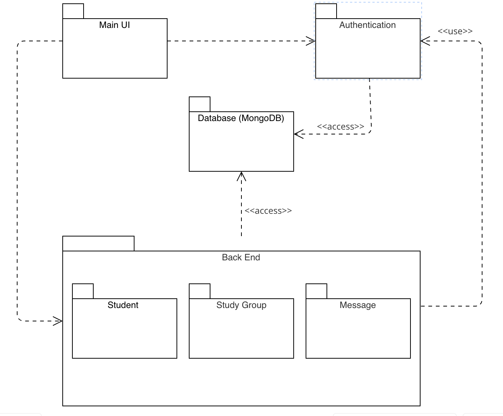

# Deliverable 5 - Group 7

## Instructions
In this deliverable, you should describe the architectural design of your system. Structure your deliverable using the following sections. See the [Team Project Instructions](https://canvas.nau.edu/courses/29116/pages/team-project-%7C-overview) for details about formatting. Check the lecture materials and perform additional research to produce a high-quality deliverable. As usual, if you have any questions, let me know.

## 1. Description
Provide 1-2 paragraphs to describe your system to help understand the context of your design decisions. You can reuse and update text from the previous deliverables.

Grading criteria (2 points): Completeness; Consistency with the rest of the document; Adequate language.

## 2. Architecture

### UML Package Diagram - Study Sphere

The StudySphere system is designed to facilitate collaboration among college students for study groups. The goal of this package diagram is to organize the system into manageable components that align with different system functionalities, ensuring clear boundaries and easy maintenance. The system is divided into key packages: Authentication, Back End, Database (MongoDB), Main User Interface, Message, Student, and Study Group.

### Package Breakdown:
**Authentication Package:** This package manages user login and registration. It is separate because authentication is a cross-cutting concern for security and should be handled independently. It relies on MongoDB for storing user credentials and validating them during login.

**Back End Package:** This package contains all the server-side logic, including logic for managing students, study groups, and messages. The Back End package depends on the MongoDB package to retrieve and store data and is essential for processing user requests.

**Database: MongoDB Package:** This package is responsible for the data storage and retrieval logic of the system. All the data required for students, study groups, and messages are stored here. This is kept separate because it acts as the core database layer that does not depend on other parts of the system.

**Main UI Package:** This package represents the front-end components of the application, including interfaces for login/registration, group browsing, and settings. The UI components interact with the Back End to request and display data to users. 

**Message Package:** This package is responsible for handling messaging between students within study groups. It communicates with both the Study Group package for context and MongoDB for persistent storage of messages. It is separated because it deals with a specific feature that is distinct from other functionalities like authentication or data storage.

**Student Package:** The Student package contains all the student-specific data and logic, such as their registration details, study group memberships, and other relevant personal information. This package is essential as it interacts with both the Authentication package (for login credentials) and the Study Group package (to allow students to join groups). It also stores student data in MongoDB and ensures that the student’s profile is updated accordingly.

**Study Group Package:** This package contains the logic for creating, managing, and browsing study groups. It depends on the MongoDB package for storing group data and the Message package for sending messages to members. It has its own distinct functionality, so it is kept as a separate package.

## 3. Class diagram
Present a refined class diagram of your system, including implementation details such as visibilities, attributes to represent associations, attribute types, return types, parameters, etc. The class diagram should match the code you have produced so far but not be limited to it (e.g., it can contain classes not implemented yet). 

The difference between this class diagram and the one you presented in D.3 is that the latter focuses on the domain's conceptual model, while the former reflects the implementation. Therefore, the implementation details are relevant in this case. 

Grading criteria (6 points): Adequate use of UML; Adequate choice of classes and relationships; Completeness of the diagram; Adequate presentation of implementation details. 

## 4. Sequence diagram
Present a sequence diagram that represents how the objects in your system interact for a specific use case. Also include the use case's description in this section. The sequence diagram should be consistent with the class diagram and architecture. 

Grading criteria (5 points): Adequate use of UML; Adequate design of the sequence diagram; Consistency with the class diagram; Consistency with the use case description; Not including the use case description; Over simplistic diagram.

## 5. Design Patterns
Split this section into two subsections. For each subsection, present a UML class diagram showing the application of a design pattern to your system (a different pattern for each section). Each class diagram should contain only the classes involved in the specific pattern (you don’t need to represent the whole system). Choose patterns from two different categories: Behavioral, Structural, and Creational. You are not limited to design patterns studied in class. 

Tip: Your system may not be appropriate for any design pattern. In this case, for didactic purposes, be creative and extend the scope of your system slightly to make the design patterns appropriate. 

Implement each design pattern in your system and provide GitHub links to the corresponding classes. For example (the links are illustrative, aka fake!):

Car: https://github.com/user/repo/blob/master/src/com/proj/main/Car.java

IBreakBehavior: https://github.com/user/repo/blob/master/src/com/proj/main/IBreakBehavior.java 

BrakeWithABS: https://github.com/user/repo/blob/master/src/com/proj/main/BrakeWithABS.java

Brake: https://github.com/user/repo/blob/master/src/com/proj/main/Brake.java

Grading criteria (6 points, 3 for each pattern): Correct use of the design pattern as described in the literature; Adequate choice of the design pattern; Adequate implementation of the design pattern.

## 6. Design Principles
How does your design observe the SOLID principles? Provide a short description of the principles followed and give concrete examples from your classes. 

Grading criteria (6 points): Show correct understanding of SOLID principles; Provide enough details to justify how the principles were observed.

