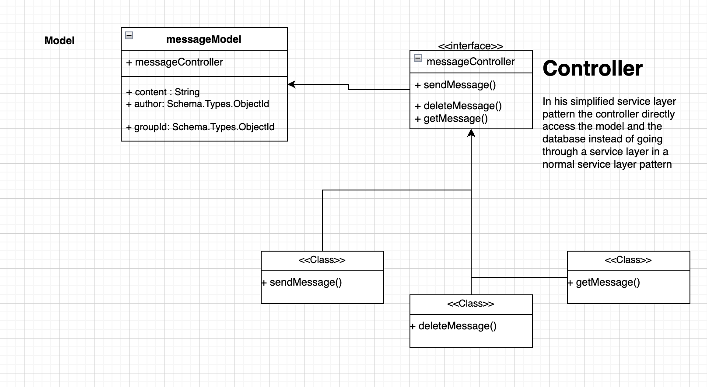

# Deliverable 5 - Group 7

## Instructions

In this deliverable, you should describe the architectural design of your system. Structure your deliverable using the following sections. See the [Team Project Instructions](https://canvas.nau.edu/courses/29116/pages/team-project-%7C-overview) for details about formatting. Check the lecture materials and perform additional research to produce a high-quality deliverable. As usual, if you have any questions, let me know.

## 1. Description

StudySphere allows students to create and manage their account, as well as create, join, and manage study groups! When a student account is created, we store a lot of information about them such as their name, email, college, and groups that they are a member/owner of. Upon account creation, they are prompted to join a group chat to meet other students to study with!

Once joined, this group will be appended to the student’s list of groups, and their unique ID will be appended to the group’s list of members. They can also create their own groups where they will be stored as the owner of the group! As the owner, they become responsible for managing it! They can update all kinds of group attributes such as its name, description, picture, members, and its administrators (who also have some of these extra privileges), among other things! All messages sent within a group chat will be saved in the group’s message thread, where they can be easily accessed and displayed time and time again! This group messaging system provides real time communication between students, enabling users to communicate effectively, plan meetings or study sessions, and most importantly make friends within their community.

## 2. Architecture

### UML Package Diagram - Study Sphere

The StudySphere system is designed to facilitate collaboration among college students for study groups. The goal of this package diagram is to organize the system into manageable components that align with different system functionalities, ensuring clear boundaries and easy maintenance. The system is divided into key packages: Authentication, Back End, Database (MongoDB), Main User Interface, Message, Student, and Study Group.

### Package Breakdown:

**Authentication Package:** This package manages user login and registration. It is separate because authentication is a cross-cutting concern for security and should be handled independently. It relies on MongoDB for storing user credentials and validating them during login.

**Back End Package:** This package contains all the server-side logic, including logic for managing students, study groups, and messages. The Back End package depends on the MongoDB package to retrieve and store data and is essential for processing user requests.

**Database: MongoDB Package:** This package is responsible for the data storage and retrieval logic of the system. All the data required for students, study groups, and messages are stored here. This is kept separate because it acts as the core database layer that does not depend on other parts of the system.

**Main UI Package:** This package represents the front-end components of the application, including interfaces for login/registration, group browsing, and settings. The UI components interact with the Back End to request and display data to users. 

**Message Package:** This package is responsible for handling messaging between students within study groups. It communicates with both the Study Group package for context and MongoDB for persistent storage of messages. It is separated because it deals with a specific feature that is distinct from other functionalities like authentication or data storage.

**Student Package:** The Student package contains all the student-specific data and logic, such as their registration details, study group memberships, and other relevant personal information. This package is essential as it interacts with both the Authentication package (for login credentials) and the Study Group package (to allow students to join groups). It also stores student data in MongoDB and ensures that the student’s profile is updated accordingly.

**Study Group Package:** This package contains the logic for creating, managing, and browsing study groups. It depends on the MongoDB package for storing group data and the Message package for sending messages to members. It has its own distinct functionality, so it is kept as a separate package.

## 3. Class diagram

## 4. Sequence diagram

## 5. Design Patterns

### Behavioral

A design pattern used in the fronend development was the MVC or Model-View-Controller design pattern. The pattern seperates the components for data, logic and presentation. The MVC pattern can be seen very clearly in how the front end behaves due to the way the groupchat module and text region are used and how the components act as the individual components of the pattern. 

Text Region: https://github.com/jadynlaila/Study_Group_Platform/blob/dev_frontend/frontend/src/components/TextRegion.jsx 

groupChatModule: https://github.com/jadynlaila/Study_Group_Platform/blob/dev_frontend/frontend/src/components/GroupChatModule.jsx 

### Architectural

The MessageController in our controllers folder implements a simplified Service Layer Pattern by acting as the controller that handles HTTP requests and delegates the business logic to models or services. In this simplified version, the controller is directly responsible for processing incoming requests, handling input validation, interacting with the models, and sending responses. In our pattern there isn’t a separate service layer in this version. The controller directly uses the Model to access the database and handle business logic. Similar patterns can also be found in the other controllers and models.

messageController: https://github.com/jadynlaila/Study_Group_Platform/blob/dev_backend/backend/controllers/messageController.js

## 6. Design Principles

### Single Responsibility Principle

In our product, the `Student`, `Group`, and `Message` classes meet the criteria for the Single Responsibility Principle as these classes are each responsible for their own tasks and not each others', but for circumstances where an object from one class has to modify data within another class, that target class's interface is called. For example, if a student object is trying to join a group, it will use interfaces from the Group class in order to perform those actions.

### Open-Closed Principle

In our product, our classes implement the Open-Closed Principle as each class is open to having subclasses and other extensions without requiring the modification of the parent classes. For example, if we wanted to make a subclass of `Group` such as `ProjectGroup` or `StudyGroup`, the parent class would not have to be modified.

### Liskov Substitution Principle

Within our product, subtypes (which currently do not exist) are able to be replaced by their base types, fulfilling the Liskov Substitution Principle. For example, if we were to make a subclass `ProjectGroup` from `Group`, then you can still treat both classes the same.

### Interface Segregation Principle

Our product does not currently follow the Interface Segregation Principle as our classes `Student`, `Group`, and `Message` are currently only have catch-all interfaces that handle everything about that class. While we could modify our class structure to accomodate for that, it isn't currently implemented, nor is it particularly on our roadmap.

### Dependency Inversion Principle

Each class contains two implementation types:
- HTTP request
- Mongoose library calls

Both of these implementation methods contain a one-way abstraction where the caller doesn't need to know how how either implementation works but can still work with data in a simple way.

For example, the `Student` class contains abstraction methods for obtaining/saving data via an HTTP request, and those abstraction methods contain further abstractions for saving or retreiving data from the database.
