# Deliverable 6 - Group 7

## 1. Introduction
StudySphere is an intuitive platform that empowers students to create and manage accounts, connect with peers, and form study groups with ease. Upon account creation, users provide essential information such as their name, email, college, and groups they are affiliated with. Students are encouraged to join or create study groups, fostering a collaborative environment where they can interact, exchange ideas, and prepare for academic success. Each group features real-time messaging, allowing seamless communication for scheduling study sessions, planning meetings, or simply making new friends within their academic community.

The platform enables students to take ownership of their groups by managing attributes like group names, descriptions, pictures, members, and administrators. Group owners and administrators have enhanced privileges to ensure smooth group functionality. All group messages are stored in dedicated threads, ensuring easy access and continuity. By combining user-friendly design with robust features, StudySphere provides an innovative way for students to "study smarter together" and build meaningful connections, both virtually and in person. The current project can be found at the following link: [StudySphere GitHub Repository](https://github.com/jadynlaila/Study_Group_Platform)

## 2. Implemented requirements
### Jadyn Calhoun 

**Requirement:** As a student, I want to be able to create an account

**Issue:** [User Story - Account Creation ](https://github.com/jadynlaila/Study_Group_Platform/issues/100)

**Pull request:** [Pull Request](https://github.com/jadynlaila/Study_Group_Platform/pull/159)

**Implemented by:** Jadyn Calhoun

**Approved by:** Alexander Anthis

**Print screen:** 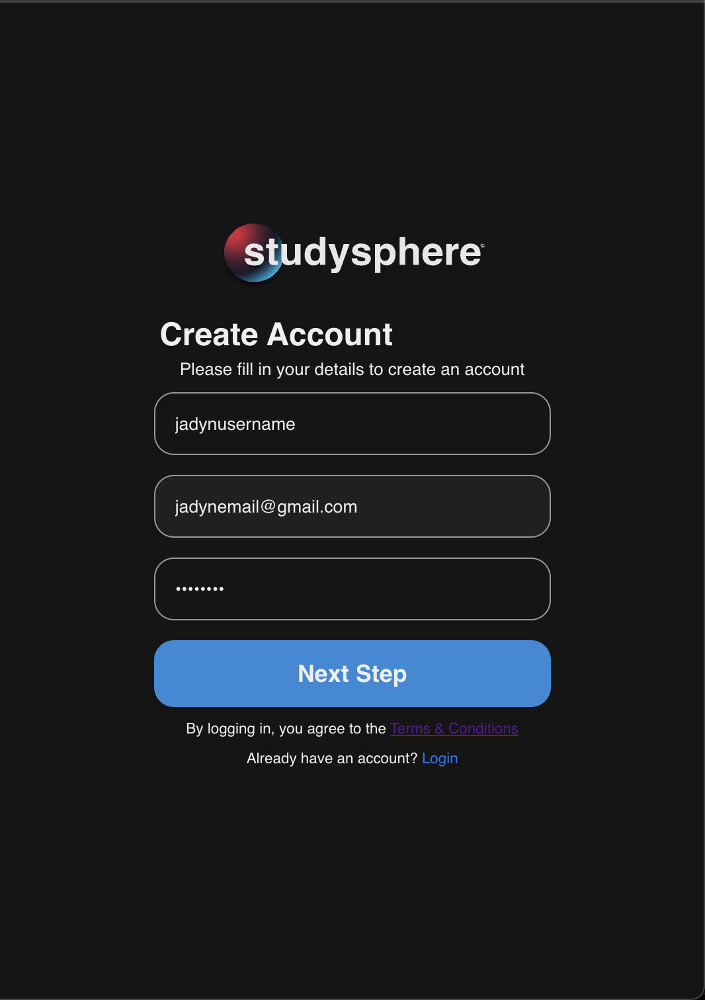

**Print screen:** 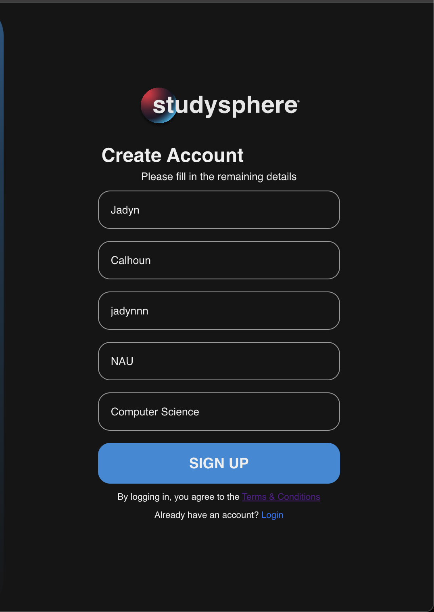

**Print screen:** 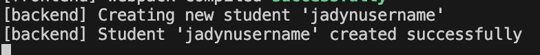

**Requirement:** As a student, I want to be able to log in to my account

**Issue:** [User Story - Student Login ](https://github.com/jadynlaila/Study_Group_Platform/issues/173)

**Pull request:** [Pull Request](https://github.com/jadynlaila/Study_Group_Platform/pull/159)

**Implemented by:** Jadyn Calhoun

**Approved by:** Alexander Anthis

**Print screen:** 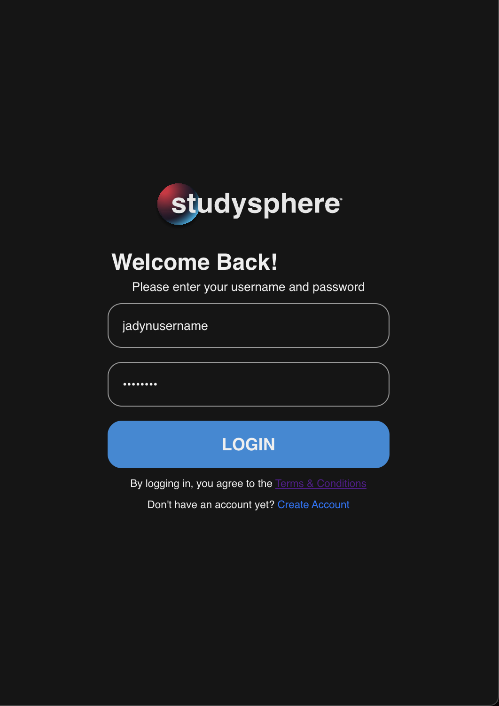

**Requirement:** As a student, I want to access my own information when I log in

**Issue:** [User Story - User Info ](https://github.com/jadynlaila/Study_Group_Platform/issues/174)

**Pull request:** [Pull Request](https://github.com/jadynlaila/Study_Group_Platform/pull/165)

**Implemented by:** Jadyn Calhoun

**Approved by:** Jack Lealos

**Print screen:** 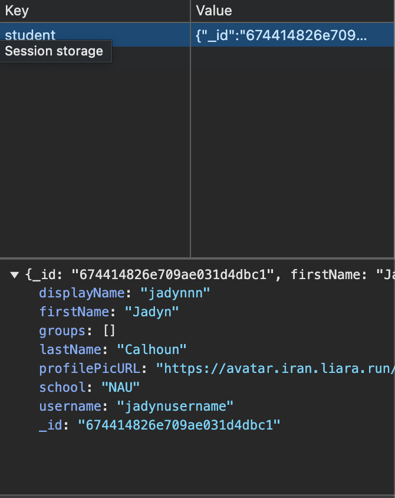

**Requirement:** As a student, I want to see what groups I am a member of

**Issue:** [User Story - Group View ](https://github.com/jadynlaila/Study_Group_Platform/issues/175)

**Pull request:** [Pull Request](https://github.com/jadynlaila/Study_Group_Platform/pull/166)

**Implemented by:** Jadyn Calhoun

**Approved by:** Jack Lealos

**Print screen:** 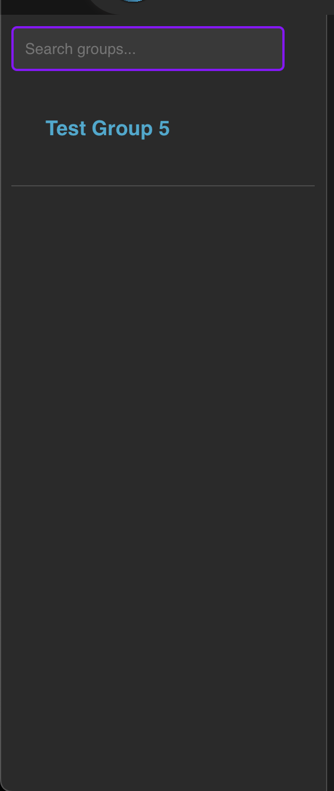

**Requirement:** As a student, I would like to see messages that are sent in groups I am a member of

**Issue:** [User Story - View Messages ](https://github.com/jadynlaila/Study_Group_Platform/issues/176)

**Pull request:** [Pull Request](https://github.com/jadynlaila/Study_Group_Platform/pull/170)

**Implemented by:** Jadyn Calhoun

**Approved by:** Rudra Amin

**Print screen:** 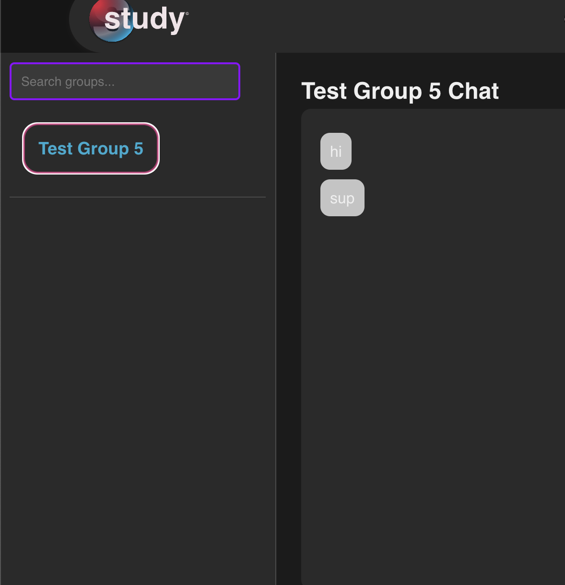

##### User Story: 
https://github.com/jadynlaila/Study_Group_Platform/issues/178

##### Requirement: 
Create a page for User settings, to edit details of their profile. It must be able to edit Name, Username, Email, and edit the profile picture displayed.

##### Issue: 
https://github.com/jadynlaila/Study_Group_Platform/issues/56

##### Pull request: 
https://github.com/jadynlaila/Study_Group_Platform/pull/183

##### Implemented by: 
Jack Lealos

##### Approved by: 
Alex

##### Print screen: 
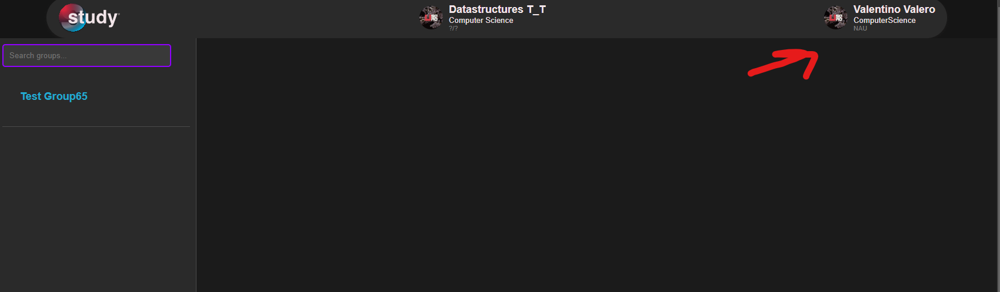
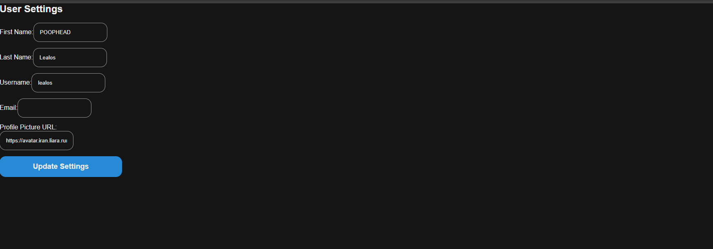

##### User Story: 

https://github.com/jadynlaila/Study_Group_Platform/issues/180
##### Requirement: 
Create a page for Group settings to edit details of the group. It must include being able to edit Name, Description, max members, and see a list of members in the group.
##### Issue: 
https://github.com/jadynlaila/Study_Group_Platform/issues/56

##### Pull request:
 https://github.com/jadynlaila/Study_Group_Platform/pull/183

##### Implemented by: 
Jack Lealos

##### Approved by: 
Alex

##### Print screen: 
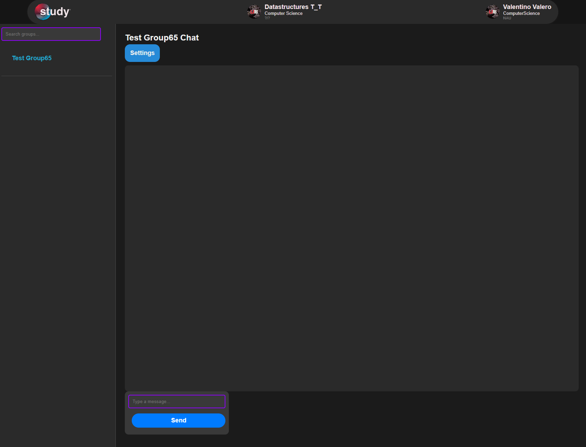
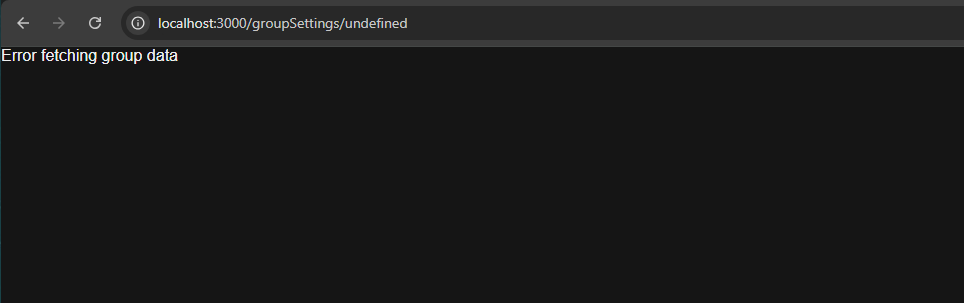

(The group settings do not properly allocate the groupID from the specific groups. However they would have similar styling and function to the user settings.)

## 3. Tests

### 3.1 Unit tests

For our project, we used `Jest` as our testing framework. The tests can be located under `Study_Group_Platform/backend/controllers` ([GitHub link here](https://github.com/jadynlaila/Study_Group_Platform/tree/dev/backend/controllers)), and the test files will contain the extension `.test.js`.

The classes that are being tested include:
- [groupController.js](https://github.com/jadynlaila/Study_Group_Platform/blob/dev/backend/controllers/groupController.js) (test file: [groupController.test.js](https://github.com/jadynlaila/Study_Group_Platform/blob/dev/backend/controllers/groupController.test.js))
- [messageController.js](https://github.com/jadynlaila/Study_Group_Platform/blob/dev/backend/controllers/messageController.js) (test file: [messageController.test.js](https://github.com/jadynlaila/Study_Group_Platform/blob/dev/backend/controllers/messageController.js))

Each test creates a mock object, saves it to the database, runs its transactions/tests, and deletes the mock objects afterwards.

#### Demo Image

*Note: The failed test suites are from other unimplemented test suites. These could not be removed in time for writing the deliverable.*

### 3.2 Acceptance tests

Unfortunately, we do not have any acceptance tests available.

## 4. Demo
Include a link to a video showing the system working.

Grading criteria (10 points): This section will be graded based on the quality of the video and on the evidence that the features are running as expected. Additional criteria are the relevance of the demonstrated functionalities, the correctness of the functionalities, and the quality of the developed system from the external point of view (user interface).

[ insert content here ]

## 5. Code quality
Describe how your team managed code quality. What were your policies, conventions, adopted best practices, etc., to foster high-quality code? 

**Backend:** To ensure high-quality code, our team implemented several practices and adhered to specific conventions and policies. First, we adopted a consistent coding style, this ensured uniformity and made our code easier to read and maintain. We also emphasized descriptive naming conventions for variables, functions, and classes to enhance clarity. Our team ensured high-quality code by also following SOLID principles, including the Single Responsibility, Open-Closed, and Liskov Substitution Principles, while acknowledging that our current implementation does not fully adhere to the Interface Segregation Principle. We also used the Service Layer Design Pattern to separate business logic from controllers, ensuring modularity and scalability. To validate functionality, we implemented unit testing for individual components and acceptance testing to ensure the system met user requirements.

**Frontend:**
Our team managed to maintain high code quality by keeping structure and style consistent throughout the project. We used a consistent naming convention for variables, functions, and classes.
## 6. Lessons learned

**Alexander Anthis:**: During the second release of StudySphere, I learned write Unit Tests as well as acceptance test for our website. I also learned how to link backend functions to frontend and make the webitse functional.

**Daira Santacruz:** Through the second release I learned how to make and search for groups. I also learned how to link backend functions to the front UI, more specifically searching and joining groups. One thing I would maybe change is have a seperate page for what users see once they login instead of the current home/groups page.

**Rudra Amin:** I had no previous expirience with building a website so this was all very new to me.Through our second release I learened how to write backend function as well as work with routes for the functions. I also learend how to implement desgin patterns in our code. I learned different design patterns and then implemented them into our code. 

**Jack Lealos:** During the second release I learned different design patterns as well as implemented them in our code. I also learned how to link the backend code with the frontend, More specifically I linked the groups and user settings functions. 

**Jadyn Calhoun:** Throught the second release I learned how to link backend funcitons with the UI. More specifically I learned how to link the login and user registration page as well as the navigation panel. I also learned how to input mock data into out server to test functions.

**Valentino Valero:** Over the duration of this project, I have learned the importance of having a gameplan. Specifically frontend, having built a figma prototype for each and every page proved very beneficial. Without this figma prototype, frontend wouldve been very lost and it would be harder to communicate and understand what needs to be built.
