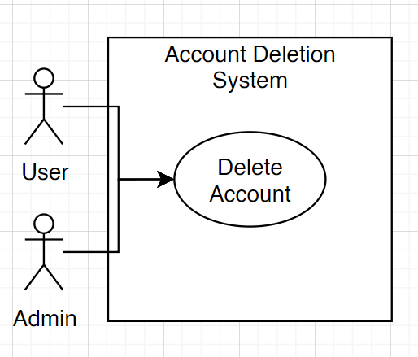

# Deliverable 2

*Group 7*

# 1\. Positioning

## 1.1 Problem Statement

| The problem of  | Difficulty in connecting with peers for study collaboration |
| :---- | :---- |
| **affects** | College students across various disciplines in different universities |
| **The impact of which is** | Diminished academic performance and lost opportunities for social interaction and skill development which can lead to lower retention rates and a lack of community among students |

**Problem Statement**: The problem of difficulty in connecting with peers for study collaboration affects college students across various disciplines, particularly those in larger universities who may feel isolated or unsure about finding study groups. The impact of this problem is diminished academic performance, increased stress, and lost opportunities for social interaction and skill development, which can lead to lower retention rates and a lack of community among students.

## 1.2 Product Position Statement

| For | College students |
| :---- | :---- |
| **Who** | Struggle to find and connect with study groups for collaborative learning |
| **The (product name)** | Study Sphere is a web platform |
| **That** | Simplifies the process of discovering, joining and scheduling study groups to enhance academic success and build community |
| **Unlike** | Traditional social media platforms or general messaging apps |
| **Our product** | Focuses specifically on connecting students based on their courses and study needs, fostering a supportive academic environment |

## 1.3 Value Proposition and Customer Segment

**Value Proposition:** “Study Smarter Together” \- Empowers students to collaborate by simplifying the process of finding and connecting with study groups, enhancing academic success.

**Customer Segment:**  College students who are looking for study groups

## 1.1 Problem Statement

## 1.2 Product Position Statement

## 1.3 Value Proposition and Customer Segment

# 2. Stakeholders
**Users:** students who will be using the app to join and interact in the study groups. Their feedback will guide future updates and how the app is received for other students.

**Developers:** Frontend and Backend developers responsible for building the website. They ensure a user-friendly interface that performs tasks efficiently.

**Competitors**: Companies or similar products to ours: Discord, LinkedIn, Social media platforms. Their features will help our website’s unique value proposition.

# 3. Functional Requirements (features)

1. Student accounts that can be created, updated, and deleted  
2. Study groups that students can create,delete, join, and leave  
3. Group settings that allow for changes in membership and administration  
4. Group calendar that allows students to input their availability  
5. Scheduling automation that provides groups with optimal meeting times  
6. Study group chats that are customizable (background color, chat icon/picture) and allow for efficient communication between students

# 4. Non-functional Requirements

## 1. Performance

 **Importance:** Performance ensures that users have a positive experience interacting with the web application with benefits like quick loading of information, snappy feel, and increasing that real-time interaction feel that one would need for a study group.

 **Verifiability:** System should maintain a response time of less than 5 seconds for most interactions a user will encounter, the most important being group chat interactions. Under a load of X users, this will be very important to maintain.

## 2. Security

 **Importance:** This application handles information that would be considered sensitive ( College, email, schedule, name, etc. ). Such information needs to be protected from nefarious or unauthorized individuals, ensuring the user's trust in the product.

 **Verifiability:** The system should undergo data penetration testing and use encryption for crucial user data. Passwords should also be hashed.

## 3. Compatibility

 **Importance:** This platform must be comfortably accessible across most commonly used devices from computers with different OS’s, browsers, and mobile devices. This allows more students to use the product which is ideal due to its nature.

 **Verifiability:** The web application should be compatible with the top 3 commonly used browsers and work across mobile and tablet devices.

## 4. Upscaling potential ( new features & accommodation for high traffic )

 **Importance:** ideally this product should grow in terms of user traffic, allowing more groups to be joined and increasing the overall efficiency of accommodating users in their academic studies. Scalability is essential for the continuation of accommodation and keeping performance up to par.

 **Verifiability:** The system should be easily scalable in the case we run out of resources, such as increasing ram or storage capacity. This also includes room for new features to be easily implemented if needed overtime.
# 5. MVP

# 6. Use Cases 

## 6.1 Use Case Diagram

## 6.2 Use Case Descriptions and Interface Sketch

**Use Case Description:** Schedule Meeting  
**Actor:** User/Student  
**Trigger:** A user within a study group wants to schedule a meeting with other group members  
**Pre-Conditions:** None  
**Post-Condition:** Display suggested optimal meeting times  
**Success Scenario:**

1a. Meeting is scheduled

**Alternate scenarios:**

2a. Meeting is not scheduled  
2b. One or more members do not attend meeting

**Interface Sketch:**

---

**Use Case Description:** Create an account

**Actor:** Student

**Trigger:** The student wants to sign up

**Pre-Conditions:** The student selects “Sign Up”

**Post-Condition:** A new student account is created

**Success Scenario:**
  1a. The student enters their full name, display name, password, email, number (optional), and their school
  1b. The program ensures the student answered all necessary questions
  1c. A request is made to the database
  1d. The students data is uploaded to the database
  * The student can now sign in 
  
**Alternate scenarios:**
  * The student did not provide all necessary information
  * The system informs the student and they are instructed to try again
  
    a. The student provides invalid information (ex. improper password, username, or  
           email formatting)
           
  * The system informs the student and they are instructed to try again

**Interface Sketch:**

---

**Use Case Description:** Search for New Groups   
**Actor:** User  
**Trigger:** Student wants to find new groups to join.   
**Pre-Conditions:**    Groups have to be created 

**Post-Conditions**  None  
**Success Scenario:**  
 1. Student successfully finds study groups  
 2. The search matches the resulting groups  

**Alternate scenarios:**   

2a. Not signed in
1. Student is not signed in, so prompted to sign in  

3a. User doesnt like group choices
1. Student does not successfully find a group  

4a. Spelling error
1.Student misspells group name  

5a.No groups found
1. System finds no groups matching search  

**Interface Sketch:**  

---

**Use Case Description:** Create an account  
**Actor:** Student  
**Trigger:** The student wants to sign up  
**Pre-Conditions:** The student selects “Sign Up”  
**Post-Condition:** A new student account is created  
**Success Scenario:**

1. The student enters their full name, display name, password, email, number (optional), and their school  
2. The program ensures the student answered all necessary questions  
3. A request is made to the database  
4. The students data is uploaded to the database  
5. The student can now sign in 

**Alternate scenarios:**   
2a. The student did not provide all necessary information

The system informs the student and they are instructed to try again

2b. The student provides invalid information (ex. improper password, username, or
email formatting)

The system informs the student and they are instructed to try again

**Interface Sketch:**  
   

---

**Use Case Description:** Delete Account

**Actor:** User

**Trigger:** Student wishes to end use of Study Sphere and delete their account

**Pre-Conditions:**

- User must have an account.
- User must be logged in.
- User must have access to password.
  
**Post-Conditions:**
  
- Must be approved by Administrator
  
**Success Scenario:**
  
1. Student has an account
2. Student successfully logs in
3. Student has access to account password
4. Student initiates account removal request
5. System pushes request to administrator
6. Admin Approves account removal request
7. User is logged out
8. Users data is removed
   
**Alternate scenarios:**

1a. Student does not have acan ccount and therefore cannot delete account.

2a. Student is unable to log in and thus cannot delete account.

3a. Student does not have password and therefore cannot delete account.

**Interface Sketch:**

---

**Use Case Description:** Create Study Group  
**Actor:** User/ Student  
**Trigger:** Student want to create a new study group  
**Pre-Conditions:**

* User has to be signed into their account

**Post-Conditions:**

* None

**Success Scenario:**

1. Student successfully creates study groups  
2. Other students are able to join

**Alternate scenarios:** 

1a. Student is not signed in, so prompted to sign in

1.The system informs user and prompts to sign in 

1b. Student does not successfully complete steps to create group  

1.The system asks user to fill information accordingly and try again

2a. Student deletes group

1.The system shows group as no longer available and suggests to look for more groups.

**Interface Sketch:**  

 

# 7. User Stories
**Rudra:**

* As a student I want a group dashboard so I can join groups related to my classes.
  * Priority: High
  * Estimated Hours: 12
  
* As a student I want to create a group option so I can make my own groups.
  * Priority: High
  * Estimated Hours: 6

**Jack**  
- As a student, I want to be able to connect with other students so that we can communicate times to meet and study.  
    - Priority: High  
    - Estimated Hours: 8  

- As a student, I want to have a group calendar so that everyone in the group is able to see when events are scheduled  .  
    - Priority: Medium  
    - Estimated Hours: 3  

**Jadyn**: 

* As a student with a busy schedule, I want in-app schedule optimization so that we can easily find times to study.

  * Priority: High  
  * Estimated Hours: 13

* As a student who has a hard time talking to people in class, I want finding groups to be as easy as possible so I can meet people to study with without as much pressure.

  * Priority: High
  * Estimated Hours: 5

**Alex**:

* As a student, I want to be able to find students in my class section so that I can meet people who are on the same page as me.  
  * Priority: Medium
  * Estimated Hours: 3

**Valentino:** 
- As a student, I want enrolled-group search options so that I can find the groups I'm already in easily.
    - Priority: high
    - Estimated Hours: 5
- As a student, I want extended social features so that I can connect and network with students beyond the college scope.
    - Priority: medium
    - Estimated Hours: 5

* As a student, I want to be able to communicate well with my group mates so that we can keep our conversations organized.  
  * Priority: High
  * Estimated Hours: 8

**Daira**: 

* As a student, I want a platform that is easy to use so that I can quickly find study groups.  
  * Priority: High  
  * Estimated Hours: 5 hours  
* As a student, I want to be able to look up study groups by course so that I can find students in my classes.  
  * Priority: Medium  
  * Estimated Hours: 8 hours

# 8. Issue Tracker
[GitHub Repo Issues](https://github.com/jadynlaila/Study_Group_Platform/issues?q=is%3Aopen+is%3Aissue+label%3A%22user+story%22)

