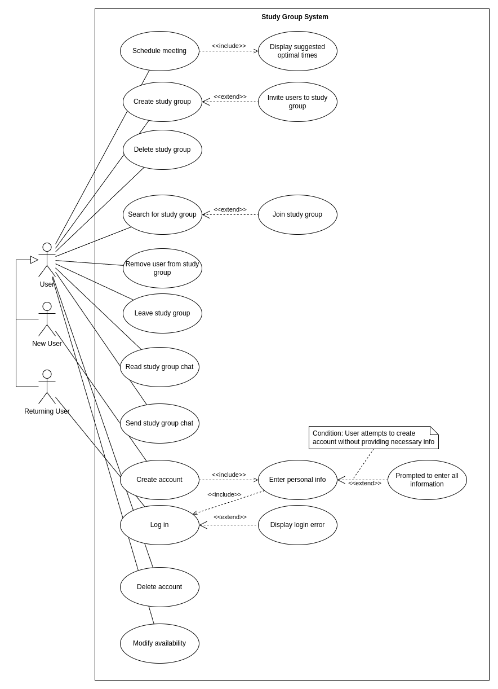
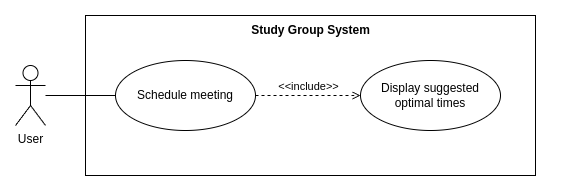
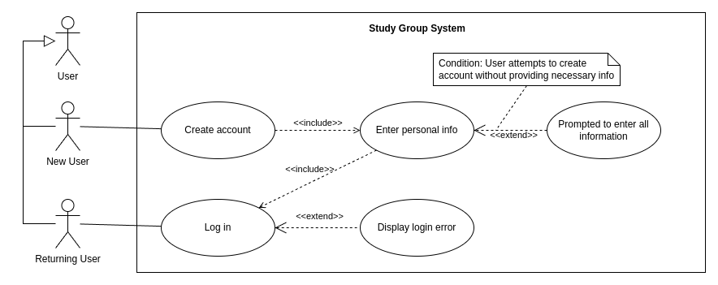
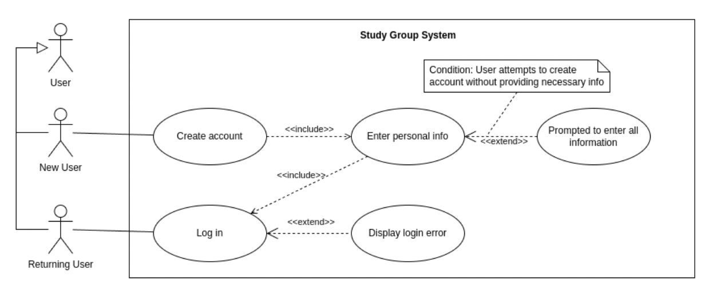
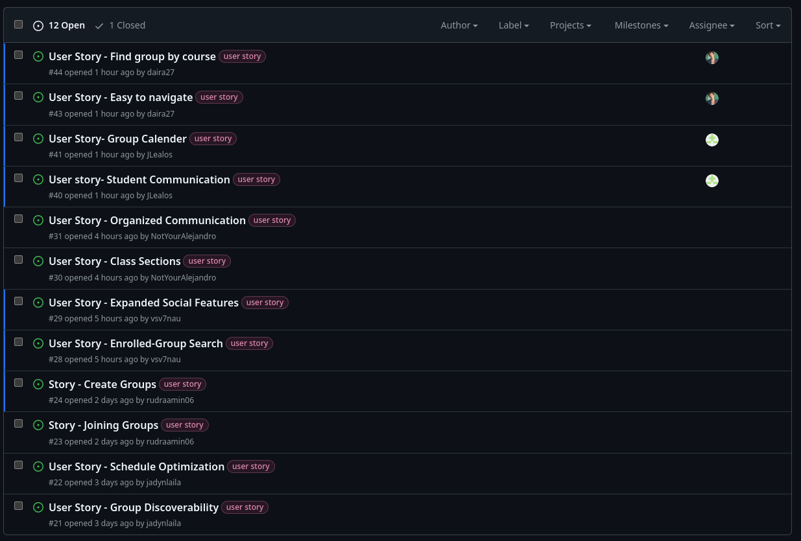

# Deliverable 2

## Group 7

# 1. Positioning

## 1.1 Problem Statement

## 1.2 Product Position Statement

## 1.3 Value Proposition and Customer Segment

# 2. Stakeholders
**Users:** students who will be using the app to join and interact in the study groups. Their feedback will guide future updates and how the app is received for other students.

**Developers:** Frontend and Backend developers responsible for building the website. They ensure a user-friendly interface that performs tasks efficiently.

**Competitors**: Companies or similar products to ours: Discord, LinkedIn, Social media platforms. Their features will help our website’s unique value proposition.

# 3. Functional Requirements (features)

1. Student accounts that can be created, updated, and deleted  
2. Study groups that students can create,delete, join, and leave  
3. Group settings that allow for changes in membership and administration  
4. Group calendar that allows students to input their availability  
5. Scheduling automation that provides groups with optimal meeting times  
6. Study group chats that are customizable (background color, chat icon/picture) and allow for efficient communication between students

# 4. Non-functional Requirements

# 5. MVP

# 6. Use Cases

## 6.1 Use Case Diagram

## 6.2 Use Case Descriptions and Interface Sketch
**Use Case Description:** Schedule Meeting  
**Actor:** User/Student  
**Trigger:** A user within a study group wants to schedule a meeting with other group members  
**Pre-Conditions:** None  
**Post-Condition:** Display suggested optimal meeting times  
**Success Scenario:**

1a. Meeting is scheduled

**Alternate scenarios:**

2a. Meeting is not scheduled  
2b. One or more members do not attend meeting

**Interface Sketch:**

**Use Case Description:** Create an account

**Actor:** Student

**Trigger:** The student wants to sign up

**Pre-Conditions:** The student selects “Sign Up”

**Post-Condition:** A new student account is created

**Success Scenario:**
  1a. The student enters their full name, display name, password, email, number (optional), and their school
  1b. The program ensures the student answered all necessary questions
  1c. A request is made to the database
  1d. The students data is uploaded to the database
  * The student can now sign in 
  
**Alternate scenarios:**
  * The student did not provide all necessary information
  * The system informs the student and they are instructed to try again
  
    a. The student provides invalid information (ex. improper password, username, or  
           email formatting)
           
  * The system informs the student and they are instructed to try again

**Interface Sketch:**

**Use Case Description:** Search for New Groups   
**Actor:** User  
**Trigger:** Student wants to find new groups to join.   
**Pre-Conditions:**    Groups have to be created 

**Post-Conditions**  None  
**Success Scenario:**  
 1. Student successfully finds study groups  
 2. The search matches the resulting groups  

**Alternate scenarios:**   

2a. Not signed in
1. Student is not signed in, so prompted to sign in  

3a. User doesnt like group choices
1. Student does not successfully find a group  

4a. Spelling error
1.Student misspells group name  

5a.No groups found
1. System finds no groups matching search  

**Interface Sketch:**  

**Use Case Description:** Create an account  
**Actor:** Student  
**Trigger:** The student wants to sign up  
**Pre-Conditions:** The student selects “Sign Up”  
**Post-Condition:** A new student account is created  
**Success Scenario:**

1. The student enters their full name, display name, password, email, number (optional), and their school  
2. The program ensures the student answered all necessary questions  
3. A request is made to the database  
4. The students data is uploaded to the database  
5. The student can now sign in 

**Alternate scenarios:**   
2a. The student did not provide all necessary information

The system informs the student and they are instructed to try again

2b. The student provides invalid information (ex. improper password, username, or
email formatting)

The system informs the student and they are instructed to try again

**Interface Sketch:**  
   

# 7. User Stories
**Rudra:**

* As a student I want a group dashboard so I can join groups related to my classes.
  * Priority: High
  * Estimated Hours: 12
  
* As a student I want to create a group option so I can make my own groups.
  * Priority: High
  * Estimated Hours: 6

**Jack**  
- As a student, I want to be able to connect with other students so that we can communicate times to meet and study.  
    - Priority: High  
    - Estimated Hours: 8  

- As a student, I want to have a group calendar so that everyone in the group is able to see when events are scheduled  .  
    - Priority: Medium  
    - Estimated Hours: 3  

**Jadyn**: 

* As a student with a busy schedule, I want in-app schedule optimization so that we can easily find times to study.

  * Priority: High  
  * Estimated Hours: 13

* As a student who has a hard time talking to people in class, I want finding groups to be as easy as possible so I can meet people to study with without as much pressure.

  * Priority: High
  * Estimated Hours: 5

**Alex**:

* As a student, I want to be able to find students in my class section so that I can meet people who are on the same page as me.  
  * Priority: Medium
  * Estimated Hours: 3

* As a student, I want to be able to communicate well with my group mates so that we can keep our conversations organized.  
  * Priority: High
  * Estimated Hours: 8

# 8. Issue Tracker
[GitHub Repo Issues](https://github.com/jadynlaila/Study_Group_Platform/issues?q=is%3Aopen+is%3Aissue+label%3A%22user+story%22)

