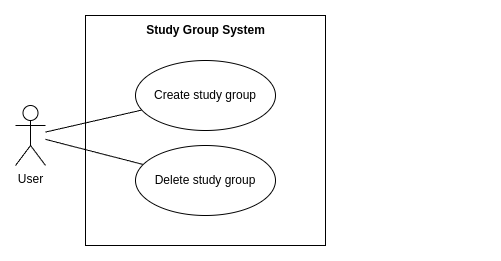

# Deliverable 2

## Group 7

# 1\. Positioning

## 1.1 Problem Statement

| The problem of  | Difficulty in connecting with peers for study collaboration |
| :---- | :---- |
| **affects** | College students across various disciplines in different universities |
| **The impact of which is** | Diminished academic performance and lost opportunities for social interaction and skill development which can lead to lower retention rates and a lack of community among students |

**Problem Statement**: The problem of difficulty in connecting with peers for study collaboration affects college students across various disciplines, particularly those in larger universities who may feel isolated or unsure about finding study groups. The impact of this problem is diminished academic performance, increased stress, and lost opportunities for social interaction and skill development, which can lead to lower retention rates and a lack of community among students.

## 1.2 Product Position Statement

| For | College students |
| :---- | :---- |
| **Who** | Struggle to find and connect with study groups for collaborative learning |
| **The (product name)** | Study Sphere is a web platform |
| **That** | Simplifies the process of discovering, joining and scheduling study groups to enhance academic success and build community |
| **Unlike** | Traditional social media platforms or general messaging apps |
| **Our product** | Focuses specifically on connecting students based on their courses and study needs, fostering a supportive academic environment |

## 1.3 Value Proposition and Customer Segment

**Value Proposition:** “Study Smarter Together” \- Empowers students to collaborate by simplifying the process of finding and connecting with study groups, enhancing academic success.

**Customer Segment:**  College students who are looking for study groups

## 1.1 Problem Statement

## 1.2 Product Position Statement

## 1.3 Value Proposition and Customer Segment

# 2. Stakeholders

# 3. Functional Requirements (features)

# 4. Non-functional Requirements

# 5. MVP

# 6. Use Cases 

## 6.1 Use Case Diagram

## 6.2 Use Case Descriptions and Interface Sketch

---

**Use Case Description:** Create Study Group  
**Actor:** User/ Student  
**Trigger:** Student want to create a new study group  
**Pre-Conditions:**

* User has to be signed into their account

**Post-Conditions:**

* None

**Success Scenario:**

1. Student successfully creates study groups  
2. Other students are able to join

**Alternate scenarios:** 

1a. Student is not signed in, so prompted to sign in

1.The system informs user and prompts to sign in 

1b. Student does not successfully complete steps to create group  

1.The system asks user to fill information accordingly and try again

2a. Student deletes group

1.The system shows group as no longer available and suggests to look for more groups.

**Interface Sketch:**  

 
---

# 7. User Stories
# **Daira**: 

* As a student, I want a platform that is easy to use so that I can quickly find study groups.  
  * Priority: High  
  * Estimated Hours: 5 hours  
* As a student, I want to be able to look up study groups by course so that I can find students in my classes.  
  * Priority: Medium  
  * Estimated Hours: 8 hours

# 8. Issue Tracker

