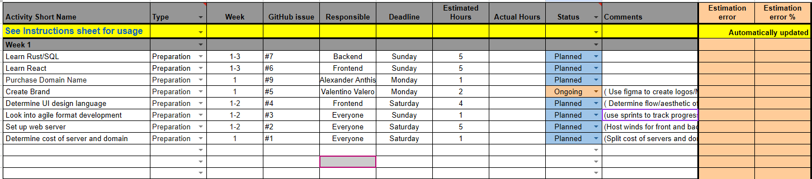

# StudySphere
This is the repository where the StudySphere project will be located.

## 01. Introductions
### Alexander Anthis
Hello! I'm a Computer Science student at NAU, and I'm focusing my efforts towards backend software development. I am familiar with C, Python, Rust, and SQL, and I am currently working for NAU as a system administrator  for the university supercomputer.

### Rudra Amin
Hi, I like sports.

### Jack Lealos
Hi, I am an IGP student studying Software Engineering and German at NAU. I hope to work in formula one later in my career. I love to travel and play games. A few programming languages I am familiar with are C, Java, Python.

### Valentino Valero
Saludos! I'm a Multi-Disciplinary Engineer ( UI/UX Emphasis ) here at NAU. My main specialty is Frontend development so I'll be helping out with UI/UX based things. I'm familiar with C, Python, HTML, Figma, Assembly (Ew), and React. Outside of this project, you can find me working on cars and working with 3D printers for other projects.

### Jadyn Calhoun
Hi! I'm a junior Computer Science student at NAU. I love web development and thinking through complex problems. I enjoy hanging out with friends and making music!

### Daira Santacruz
Hi, I’m a Computer Science student at NAU. I study French, and I’m currently enrolled in an IGP program at NAU. Most of my experience is with frontend development.

## 02. Availability
Not everyone will be able to make every single meeting, so in order to maximize the amount of people in the meetings, multiple meetings per week will be held. Additionally, it is noted that more effort will be put into the setup of the project during it's initial creation. Meetings will usually be held in the Engineering building.

## 03. Roles for each week
For each meeting, everyone will be shifted down one role. The available meeting roles are:
- Team Leader
- Minute-Taker
- Product Owner
- Reviewer
So if you were Team Leader this meeting, you would be the Minute-Taker next meeting.

## 04. Meeting Scheduling
Our group will be holding multiple meetings per week due to limit member availability. The primary meeting will be held on Saturdays at 11am and subsequent meetings throughout the week will be held as needed.

Our estimated tracker spreadsheet [is available as a Google Docs spreadsheet](https://docs.google.com/spreadsheets/d/1hYp8FGm6eDtyWx9X4aZaYG_4264jqLZbFvZ-MnFxVMM/edit?usp=sharing).

## 05. Decision Making Process
When a decision needs to be made, it will be put to a majority vote. If a tie occurs, a coin flip will determine the winner.

## 06. Team Member Performance
At the beginning of each meeting, everyone will reflect on how the project itself is going along with how their own performance is going. This aims to give everyone the most possible transparency in terms of availability and improvements/adjustments that need to be made.

If a team member cannot show up to a meeting, the plan is to schedule another meeting in order to make sure everyone is caught up. Additionally, it is noted as common courtesy to inform the team when a deadline or meeting cannot be met as soon as possible so the team can prepare appropriately.

## 07. Project Ideas and Scope
For this project, we have chosen the name **StudySphere**. We have decided that this project will be primarily a custom-built website with desktop/mobile app support on our wishlist if we have extra time.

The project *must* include the following features:
- User profiles
- Group users together by university
  - Ask the user specifically what their university is
- Users are suggested recommended study groups that attempt to correlate with the data they provide, such as majors, minors, certifications, and current classes.
- A chat for each study room

## 08. Technologies
The technologies for the frontend include React for the web UI framework along with Nginx to host the website. The backend technologies include MariaDB for the database and Rust for the database application.

For communication, we have decided to use a Discord server that we have created as our primary form of communication throughout the development of this project.

## 09. Learning Plans
Team members who do require more knowledge for a task will be able to obtain it via courses available on Udemy along with YouTube and the use of generative AI as supplementary sources.

## 10. Retrospective
### Appreciations (highlights of contributions from team members); 
We discussed each others' strengths and what languages we are familiar with, determined languages and tools we are using, our meeting schedule, and the team's flexibility.

### Successes (what went well)
We determined a lot of main components of our project. Additionally, we worked well together and communicated our opinions clearly. We did run into issues with scheduling and were able to work through communication issues. Communicating what our next steps were was also easy.

### What didn’t go so well
Not everyone was able to be physically present in the meeting. However we have decided that we would hold multiple meetings per week to try to keep everyone as up-to-date as possible regardless of schedule interferences.

### Everyone was able to meet
Yes, everyone was able to meet together, though a couple people had to attend virtually.

### Barriers 
Some members are currently learning new technologies unfamiliar to them, so learning those technologies is our primary barrier to beginning development. However, this will not block us from planning how we want the structure to look.

### What should we try next time
We planned to have multiple meeting times and try to make them all, but to make sure we can at least make one. 

## 11. Planning of the next steps
The next meeting will be held on Saturday 2024-09-15 at 11:00 AM.

We will need a dedicated meeting in the future to determine what the database schema looks like. If there is time, then serialization formats will be discussed, otherwise another dedicated meeting will be held.

Additionally, we need to secure our server's domain name and link it to the server we have. Once that is complete, we can begin setting up everyone's development environments. While the development server/environments are being set up, the UI design language will be defined and our "service" logo will be created.

In order to keep our team as efficient as possible, we have decided to look into the Agile development style and see what elements we can integrate into our own development structure.

Finally, we believe that understanding different development perspectives can help fortify what the project should look like, so each team member is going to dedicate some time to grasp an idea as to what other technologies look like and how they are used. For example, someone who is setting up the database schema will take some time to understand the UI design along with what it looks like in React to hopefully spark some ideas regarding technology integration. 
